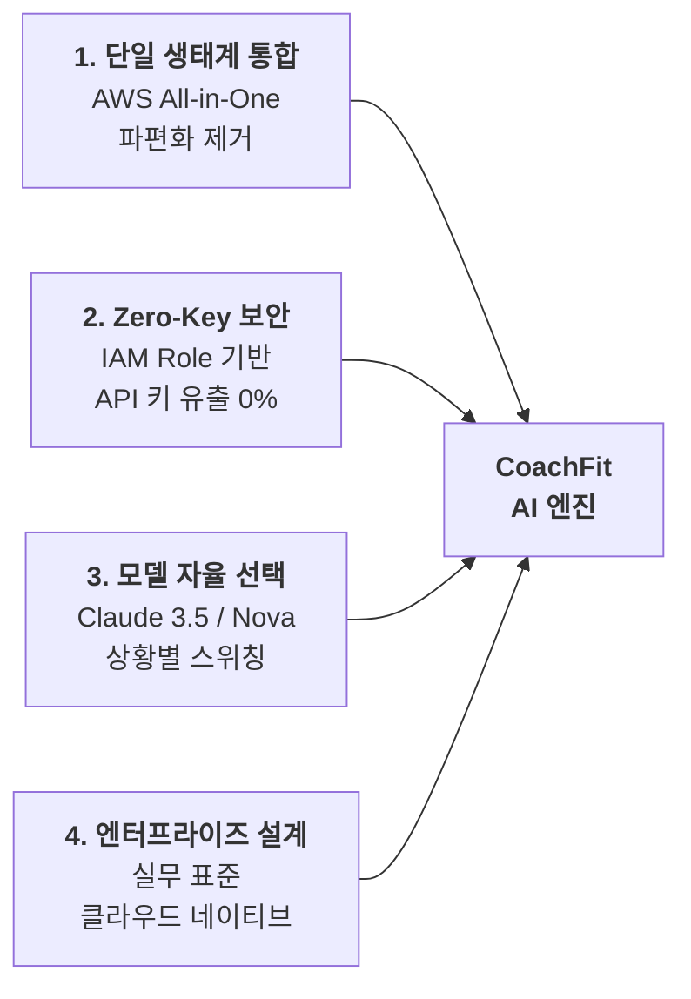

# 🎤 AWS Bedrock 도입 배경 & PPT / Q&A 심층 대비 가이드

> **프로젝트명**: CoachFit (코치핏)  
> **용도**: 캡스톤 디자인 / 프로젝트 발표 PPT 슬라이드 자료 및 교수님·심사위원 Q&A 디펜스 대비  
> **핵심 기술**: AWS Bedrock, EC2, RDS PostgreSQL, IAM Role, Claude 3.5 Sonnet, Amazon Nova

---

## 📊 1. [PPT 슬라이드용] AWS Bedrock 4대 핵심 도입 배경

### 슬라이드 ① [아키텍처] 외부 의존성을 배제한 AWS 단일 생태계 통합 (All-in-One)
* **기존 학생 프로젝트의 한계**:
  * "서버는 AWS, DB는 로컬/Supabase, AI는 OpenAI"처럼 여러 플랫폼이 파편화되어 장애 포인트(SPOF)가 증가하고 관리 비용이 분산됨.
* **CoachFit의 공학적 차별점**:
  * **Compute(EC2) + Database(RDS PostgreSQL) + AI(Bedrock)**를 동일한 AWS VPC 내 단일 클라우드 생태계로 일원화.
  * 내부 네트워크 레이턴시 단축 및 단일 콘솔을 통한 통합 모니터링(CloudWatch) 체계 구축.

---

### 슬라이드 ② [보안/컴플라이언스] API Key 노출 위험이 원천 차단된 '무키(Zero-Key)' IAM 인증
* **기존 API 방식의 치명적 리스크**:
  * OpenAI/Anthropic 직접 호출 시 `.env` 또는 코드에 `sk-...` 비밀 키를 기록해야 하므로, 깃허브 공개나 배포 시 키 탈취 및 수백만 원 과금 사고 위험 상존.
* **CoachFit의 공학적 해결책**:
  * EC2 인스턴스에 **IAM Role(`AmazonBedrockFullAccess`)**을 부여하여 인스턴스 프로파일 기반으로 자동 인가.
  * **코드와 환경 변수 어디에도 비밀 API 키를 단 1글자도 저장하지 않는 엔터프라이즈 최고 보안 등급 실현.**

---

### 슬라이드 ③ [유연성] 벤더 락인(Lock-in) 없는 멀티 파운데이션 모델 자율 스위칭
* **단일 공급자 종속 탈피**:
  * 특정 AI 회사에 종속되지 않고, AWS Bedrock 콘솔 내에서 최고 성능 모델(**Anthropic Claude 3.5 Sonnet**), 초저비용/고속 모델(**Amazon Nova Lite**), 오픈소스(**Meta Llama 3**)를 단 한 줄의 환경변수(`BEDROCK_MODEL_ID`) 변경으로 자유롭게 교체 가능.
* **AWS 최신 표준 `client.converse` API 적용**:
  * 모델마다 달랐던 입출력 JSON 형식을 AWS 통일 규격(Converse API)으로 추상화하여 유지보수성 극대화.

---

### 슬라이드 ④ [공학적 완성도] 실무 포트폴리오 수준의 클라우드 네이티브 완성도
* 단순 서드파티 라이브러리 wrapper 호출에 그치는 흔한 프로젝트를 탈피.
* **TypeScript 기반 AWS CDK(코드형 인프라)**로 EC2, RDS, Bedrock 권한을 100% 자동 프로비저닝하여 실무 대규모 인프라 운영 표준을 준수.

---

## 💰 2. [비용 분석] Bedrock 비용의 진실 & 과금 방어 전략

### 1) "Bedrock은 공짜인가요?"에 대한 정확한 팩트
* **종량제(Pay-as-you-go)**: 사용한 입력/출력 토큰(단어 수)만큼만 몇 원 단위로 정밀 청구됨.
* **학교/학생 지원**: 대학생 AWS Educate / Academy 또는 신규 계정 가입 크레딧($100~$300) 적용 시 **실제 본인 부담금 0원**.

### 2) 모델별 토큰 단가 비교 (1,000회 코칭 기준)
| 모델명 | 1,000토큰당 입력 비용 | 1,000토큰당 출력 비용 | 1,000회 코칭 시 예상 비용 | 특징 및 용도 |
| :--- | :---: | :---: | :---: | :--- |
| **Amazon Nova Lite** | **$0.00006** (약 0.08원) | **$0.00024** (약 0.32원) | **약 150원 미만** | 초가성비 / 빠른 응답 / 데모 최적화 |
| **Claude 3 Haiku** | **$0.00025** (약 0.35원) | **$0.00125** (약 1.7원) | **약 600원** | 가성비와 자연스러움의 균형 |
| **Claude 3.5 Sonnet**| $0.00300 (약 4.2원) | $0.01500 (약 21원) | 약 7,000원 | 최고 수준의 전문 피트니스 분석력 |

### 3) 무과금 방어 3중 안전망 (Zero-Cost Safety Net)
1. **평소 개발/테스트**: `AI_PROVIDER=groq` (완전 무료, Llama 3.3 70B 무제한) 또는 `AI_PROVIDER=dummy` (로컬 규칙 엔진)로 설정하여 비용 0원 유지.
2. **시연/최종 발표**: `AI_PROVIDER=bedrock`으로 원터치 전환하여 AWS 풀스택의 진가를 완벽하게 시연.
3. **AWS 예산 알림(Budgets)**: $5 이상 과금 시 즉시 이메일 경고가 오도록 임계치 설정.

---

## 🎯 3. [Q&A 디펜스] 교수님 & 심사위원 예상 질문 및 모범 답변

### Q1. "OpenAI나 구글 API를 쓰면 편한데, 왜 굳이 AWS Bedrock을 선택했습니까?"
> **[모범 답변]**  
> "가장 큰 이유는 **‘인프라 단일화’**와 **‘엔터프라이즈 보안’** 때문입니다.  
> 일반적인 외부 API는 서비스 제공자가 제각각이라 네트워크 홉(Hop)이 늘어나고, 특히 서버 내부에 API Secret Key를 직접 저장해야 하는 보안상 치명적인 취약점이 있습니다.  
> 반면 AWS Bedrock은 저희가 이미 구축한 **AWS EC2, AWS RDS와 동일한 VPC/보안 영역 내에서 동작**하며, **EC2 IAM Role(인스턴스 프로파일)을 통해 API 키 없이도 안전하게 자동 인가**됩니다. 이는 금융권 및 대기업 클라우드에서 필수적으로 요구하는 실무 표준 아키텍처를 프로젝트에 온전히 구현하고자 채택했습니다."

---

### Q2. "Bedrock을 쓰면 비용 부담이나 과금 폭탄 위험은 없나요?"
> **[모범 답변]**  
> "저희는 3단계 과금 방어 체계를 선제적으로 구축했습니다.  
> 첫째, 일상적인 개발 및 기능 테스트 단계에서는 **비용이 전혀 발생하지 않는 Groq(무료 LLM)과 스마트 룰베이스 더미 엔진을 기본값으로 활성화**하여 불필요한 API 호출을 원천 차단했습니다.  
> 둘째, Bedrock 모델 중에서도 토큰당 단가가 극도로 저렴한 **Amazon Nova Lite(1,000회 질문당 약 150원 수준)**를 지원하도록 하여 데모 및 프로덕션 비용을 최소화했습니다.  
> 셋째, AWS Budgets를 통해 월 5달러 초과 시 즉시 자동 알림 및 세션 차단 설정을 적용했습니다."

---

### Q3. "AWS Bedrock의 무키(Zero-Key) IAM 인증 원리가 정확히 무엇인가요?"
> **[모범 답변]**  
> "EC2 인스턴스가 생성될 때 AWS 메타데이터 서비스(IMDSv2)와 통신하는 **IAM 인스턴스 프로파일(`CoachFitEc2Role`)**을 바인딩했습니다.  
> 백엔드의 Python `boto3` 라이브러리는 별도의 Access Key나 Secret Key 파라미터가 없으면, 자동으로 EC2 메타데이터로부터 임시 STS(Security Token Service) 토큰을 받아 인증을 수행합니다.  
> 결과적으로 `.env` 파일이나 깃허브 코드상에 비밀 키가 단 1바이트도 존재하지 않으므로, 소스코드가 유출되더라도 API 탈취가 불가능한 구조입니다."

---

### Q4. "만약 AWS Bedrock에 일시적 장애가 나거나 네트워크 지연이 생기면 어떻게 되나요?"
> **[모범 답변]**  
> "저희는 **‘우아한 장애 복구(Graceful Degradation)’를 지원하는 하이브리드 폴백(Fallback) 구조**로 구현했습니다.  
> `app/services/ai_coach.py`의 `_call_bedrock_coaching` 함수는 `try-except` 예외 처리 파이프라인으로 감싸져 있어, Bedrock 호출 타임아웃이나 오류 발생 시 서비스가 중단되지 않고 즉시 내장된 **스마트 규칙 기반 더미 엔진(`_generate_smart_dummy_coaching`)**으로 자동 스위칭됩니다.  
> 따라서 사용자는 어떤 네트워크 상황에서도 끊김 없이 추천 루틴과 피드백을 전달받을 수 있습니다."

---

### Q5. "모바일 앱(Flutter)에서 Bedrock을 직접 호출하지 않고 EC2 백엔드를 경유하게 만든 이유는?"
> **[모범 답변]**  
> "클라이언트 직접 호출(Client-side invocation) 방식은 두 가지 치명적인 결함이 있습니다.  
> 첫째, 모바일 앱 앱 번들(APK/IPA) 디컴파일을 통해 AWS 자격증명이 쉽게 탈취됩니다.  
> 둘째, AI 코칭에는 사용자의 **RDS 데이터베이스에 저장된 최근 운동 볼륨, 신체 스펙(인바디), 세트별 수행 기록**이 종합적으로 결합되어야 합니다.  
> 따라서 백엔드가 DB에서 사용자의 데이터를 정밀 쿼리하고 프롬프트를 구성한 뒤, 내부 보안망을 통해 Bedrock과 통신하는 **BFF(Backend for Frontend) 패턴**을 준수하는 것이 아키텍처적으로 가장 올바른 정석입니다."

---

## 🗣️ 4. [발표 1분 스피치 대본] 캡스톤/데모 발표용 멘트

> "저희 CoachFit의 AI 코칭 파이프라인은 단순한 서드파티 래퍼(Wrapper)가 아닙니다.  
>
> 기존 많은 프로젝트들이 백엔드와 AI 플랫폼을 파편화하여 관리 부담과 API 키 유출 위험을 겪는 것과 달리, 저희는 **AWS EC2, AWS RDS, 그리고 AWS Bedrock을 단일 클라우드 생태계로 완전 통합**했습니다.  
>
> 특히 EC2 인스턴스에 IAM 역할을 직접 부여함으로써, **코드나 서버 파일에 API 비밀키를 단 1자도 적지 않는 무키(Zero-Key) 엔터프라이즈 보안**을 달성했습니다.  
>
> 또한 Anthropic의 최신 플래그십 모델인 **Claude 3.5 Sonnet**과 가성비 모델인 **Amazon Nova**를 환경변수 하나로 자유롭게 스위칭할 수 있으며, 이 모든 인프라를 **TypeScript 기반 AWS CDK(코드형 인프라)**로 100% 자동 배포되도록 완성했습니다."
