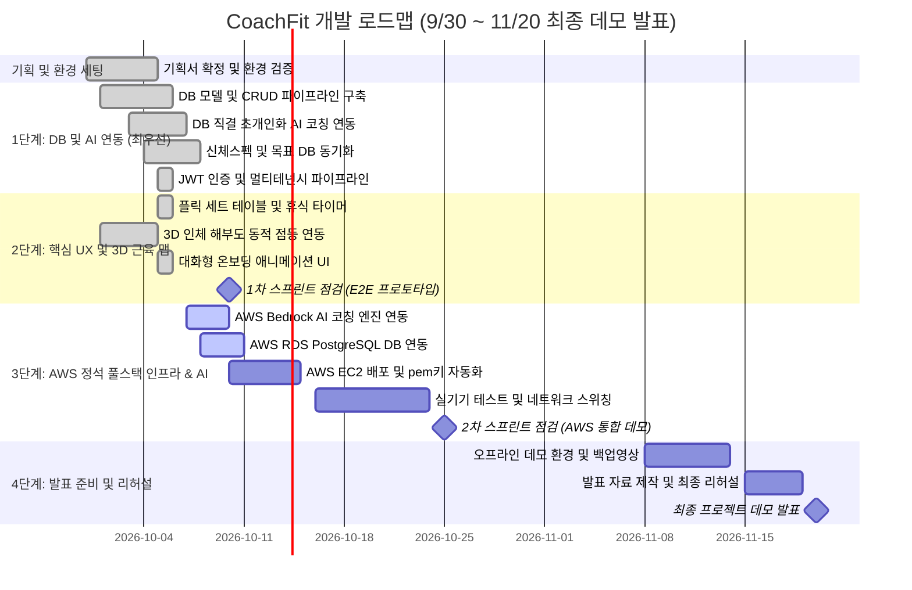

# 📅 02. WBS 및 마일스톤 일정 계획서 (Work Breakdown Structure)

> **프로젝트명**: CoachFit (코치핏)  
> **프로젝트 형태**: 2인 개발 사이드/포트폴리오 프로젝트  
> **기준일**: 2026-09-30 (10주차 시점) | **최종 목표/데모 발표일**: 2026-11-20  
> **주요 마일스톤**: 팀 내 2회 스프린트 리뷰 및 피드백 점검 (10월 하순 1차 프로토타입 / 11월 초순 2차 통합 데모)

---

## 🏁 1. 마일스톤 및 일정 로드맵 (Roadmap)

### 📌 주차별 핵심 일정표
| 주차 | 기간 | 주요 목표 및 산출물 | 마일스톤 및 점검 포인트 |
| :---: | :---: | :--- | :---: |
| **10주차** | 09.30 ~ 10.05 | 기획서(Vision, WBS, ADR, Risk, Git 규칙) 확정 및 개발 환경 점검 | 팀 협업 규칙 세팅 및 개발 착수 |
| **11주차** | 10.06 ~ 10.12 | **[최우선] DB 모델 및 AI API 코칭 파이프라인 통합 구축** - 운동 기록 CRUD + 인바디 신체 스펙 + 목표 DB 테이블 구축 - JWT 다중 사용자 인증 + 단계별 인터랙티브 온보딩 UI 완성 - DB 직결 초개인화 AI 코칭 피드백 및 추천 루틴 일괄 등록 연동 | **DB-AI E2E 파이프라인 완성** |
| **12주차** | 10.13 ~ 10.19 | **[교수님 피드백] AWS 정석 풀스택 인프라 구축 및 AI Bedrock 연동** - AWS Bedrock API(Claude 3.5 / Nova) 코칭 엔진 연동 및 IAM 무키 인증 - AWS RDS (PostgreSQL) 인스턴스 구축 및 백엔드 DB 연동 - AWS EC2 생성, pem 키 SSH 접속 및 `git pull` 자동 배포(`deploy.sh`) 완비 | **AWS 정석 풀스택 가동** |
| **12주차 말**| 10.20 ~ 10.24 | **1차 스프린트 내부 리뷰**: EC2 실서버 E2E 풀루프(앱 ↔ EC2 ↔ RDS ↔ Bedrock) 시연 | **1차 프로토타입 피드백 반영** |
| **13주차** | 10.25 ~ 11.02 | **실기기 최적화 및 폼 유효성 검증** - Android/iOS 실기기 USB 디버깅 및 EC2 서버 연동 검증 - 음수 무게 방지, 예외 처리 및 린트 제로(0) 유지 | 모바일-백엔드 실기기 안정화 |
| **14주차 초**| 11.03 ~ 11.07 | **인프라 안정화 및 듀얼 스위칭 완비** - EC2 실서버 ↔ 로컬 오프라인 `ApiConstants` 원터치 토글 환경 완비 - **2차 스프린트 내부 리뷰 (통합 데모)** | **2차 피드백 반영 및 데모 완성** |
| **14주차 말**| 11.08 ~ 11.14 | [발표 리스크 대비] 발표장 Wi-Fi 단절 대비 오프라인 완결형 로컬 구동 스크립트 점검 | 무사고 발표 대비 환경 완비 |
| **15 ~ 16주차**| 11.15 ~ 11.19 | 최종 발표 슬라이드(PPT) 제작, 시연 시나리오 리허설, 데모 영상 백업 | 최종 점검 및 리허설 |
| **16주차** | **11.20 (금)** | **CoachFit 최종 프로젝트 데모 발표 및 포트폴리오 릴리즈** | **🎉 최종 마일스톤 달성** |

---

## 🔨 2. 세부 WBS (Work Breakdown Structure)

> 모든 작업 단위(Leaf)는 **1일 ~ 3일 (1d ~ 3d)** 내에 완료할 수 있는 크기로 세분화되었습니다.

### 1. 사용자 영역 (User & Profile)
- **1.1 사용자 식별 및 프로필**
  - [x] 1.1.1 로컬 사용자 기본 식별자(`userId`) 세팅 (1d) - *기완료*
  - [x] 1.1.2 사용자 신체 정보(성별, 체중, 운동 목표) 설정 화면 (2d) - *PR #8 완료*
  - [x] 1.1.3 운동 목적 선택에 따른 AI 추천 파라미터 분기 로직 (1d) - *PR #9 완료*
  - [x] 1.1.4 사용자 프로필 및 목표 백엔드 DB 연동 (`/api/profile`) (1d) - *완료*
  - [x] 1.1.5 JWT 기반 회원가입/로그인 인증 파이프라인 및 멀티테넌시 분리 (`/api/auth`) (2d) - *PR #30 완료*
  - [x] 1.1.6 짐워크 스타일 단계별(Step-by-Step) 대화형 온보딩 애니메이션 및 설문 UI (2d) - *PR #32 완료*

### 2. 핵심 기능 영역 (Core Features - Fleek 벤치마킹)
- **2.1 운동 기록 입력 (Workout Logging)**
  - [x] 2.1.1 운동 기록 폼 기본 UI 구성 (1d) - *기완료*
  - [x] 2.1.2 세트별 무게(kg) / 횟수(reps) 동적 추가·삭제 UI (2d) - *플릭 스타일 세트 테이블 구현 완료*
  - [x] 2.1.3 이전 세트 데이터 원터치 복사 및 간편 입력 UX (1d) - *PR #7 완료*
  - [x] 2.1.4 세트 완료 시 카운트다운 휴식 타이머(60s/90s) 위젯 (2d) - *구현 완료*
- **2.2 운동 기록 조회 및 주간 통계 (Dashboard & Charts)**
  - [x] 2.2.1 최근 운동 기록 리스트 뷰 및 날짜 포맷팅 (1d) - *기완료*
  - [x] 2.2.2 기록 상세 보기 및 수정/삭제 인터랙션 (2d) - *삭제 팝업 및 API 연동 완료*
  - [x] 2.2.3 주간 누적 볼륨(요일별) 차트 렌더링 (`fl_chart` 연동) (2d) - *연동 완료*
  - [x] 2.2.4 가슴/등/하체 부위별 볼륨 비율 시각화 카드 (2d) - *PR #6 완료*
  - [x] 2.2.5 월간 운동 캘린더 (잔디 스타일 강도별 색상 / 스트릭 / 부위별 도넛 차트) (2d) - *PR #14 완료*
  - [x] 2.2.6 종목별 성장 그래프 화면 (무게/볼륨 메트릭 토글 + 라인 차트) (2d) - *PR #17 완료*
  - [x] 2.2.7 PR(개인 최고기록) 자동 트래킹 서비스 (sealed class) (1d) - *PR #17 완료*
  - [x] 2.2.8 과거 날짜 네비게이션 (주간 캘린더 스트립 + 날짜 피커 + 이전/다음 주 버튼) (1d) - *PR #17 완료*
  - [x] 2.2.9 운동 기록 수정 모달 (DELETE+CREATE 패턴) (1d) - *PR #17 완료*
  - [x] 2.2.10 세션 통째 복사 (과거 날 운동 → 오늘로) + 빈 날짜 복원 (같은 요일 세션 추천) (1d) - *PR #17 완료*
  - [x] 2.2.11 종목 검색 + 부위 필터 chip (가슴/등/어깨/하체/이두) + 메모 전용 필터 (1d) - *PR #17 완료*
  - [x] 2.2.12 신체 측정 입력 UI + 체중 추이 라인 차트 (로컬 ChangeNotifier → 서버 DB 양방향 동기화) (2d) - *PR #17 + PR #19 완료*
  - [x] 2.2.13 신체 변화 — 감량/증량 목표 체중 진행도 바 (ProfileService.targetWeightKg 자동 연동, 민트 그라데이션 카드 + 진행률 % + 남은 kg) (1d) - *PR #58 완료*
- **2.3 AI 맞춤 코칭 & 루틴 추천 (AI Coach)**
  - [x] 2.3.1 AI 추천 요청 트리거 및 응답 카드 UI 스켈레톤 (1d) - *기완료*
  - [x] 2.3.2 최근 피로도 분석 기반 오늘 추천 운동 목록 표출 UI (2d) - *완료*
  - [x] 2.3.3 추천받은 루틴을 즉시 오늘 기록으로 등록 및 운동 시작 (`importRoutine`) (2d) - *완료*
  - [x] 2.3.4 코칭 피드백 및 조언 메시지 시각화 (2d) - *시각화 완료*
- **2.4 홈 대시보드 위젯 (Home Dashboard)**
  - [x] 2.4.1 홈 진척 스트립 (오늘 세션 수 / 주간 4일 목표 진행바 / 스트릭 / 체중 목표 바) (2d) - *PR #16 완료*
  - [x] 2.4.2 최근 운동 카드 + "오늘 +2.5kg 챌린지" 점진적 과부하 제안 (1d) - *PR #16 완료*
  - [x] ~~2.4.3 빠른 등록 chip (상위 3개 종목 원탭 등록, 최근 템플릿 재사용)~~ (1d) - *PR #16 완료 → PR #37 에서 UX 간결화 피드백 반영하여 제거 (메뉴 '즐겨찾기 운동' 과 기능 중첩)*
  - [x] 2.4.4 스마트 제안 카드 (휴식 메시지 / 랜덤 종목 / 명언 3모드 일별 안정 랜덤) (1d) - *PR #16 완료*
- **2.5 오운완 커뮤니티 (Community Feed)**
  - [x] 2.5.1 커뮤니티 피드 UI + 필터칩 실제 작동 (전체 / 인기(리액션순) / 오늘 오운완 / 내 크루 / 북마크) (2d) - *PR #15 완료*
  - [x] 2.5.2 리액션 4종 (❤/💪/🔥/👏) 토글 + 포스트별 집계 (1d) - *PR #15 완료*
  - [x] 2.5.3 댓글 바텀시트 (리스트 + 입력 + 상대시간 표시) (1d) - *PR #15 완료*
  - [x] 2.5.4 오운완 작성 시 운동 기록 자동 뱃지 생성 (부위 매핑 + 총 볼륨 요약) (1d) - *PR #15 완료*
  - [x] ~~2.5.5 주간 크루 랭킹 섹션 (볼륨 top 5 + 금/은/동 색상 + 나 하이라이트)~~ (2d) - *PR #15 완료 → PR #38 에서 피드 노출 공간 확보 피드백 반영하여 제거*
  - [x] ~~2.5.6 챌린지 배너 (하체 주5회/주 10k) 참여 토글 영속화~~ (1d) - *PR #15 완료 → PR #38 에서 레이아웃 오버플로우 버그 + UX 간결화로 제거*
  - [x] 2.5.7 포스트 상세 화면 + 북마크 저장/필터 (2d) - *PR #15 완료*
  - [x] 2.5.8 커뮤니티 영속화 서비스 (shared_preferences 싱글톤 ChangeNotifier) (1d) - *PR #15 완료*
- **2.6 메뉴 & 설정 (Menu & Settings)**
  - [x] 2.6.1 무게 단위 토글 (kg ↔ lbs) + 변환 유틸 (fromKg/toKg) (1d) - *PR #23 완료*
  - [x] 2.6.2 리마인더 알림 시간 설정 (TimePicker + ON/OFF 토글) (1d) - *PR #23 완료*
  - [x] 2.6.3 테마 포인트 색상 커스터마이즈 5종 (민트/오렌지/시안/바이올렛/핑크) — main.dart 전역 즉시 반영 (2d) - *PR #23 완료*
  - [x] 2.6.4 메뉴 상단 이번 달 요약 미니 카드 (운동 횟수/총 볼륨/최다 종목) (1d) - *PR #23 완료*
  - [x] 2.6.5 업적 & 뱃지 시스템 — 13종 뱃지 (스트릭/볼륨/BIG3/시간대/다양성) (2d) - *PR #23 완료*
  - [x] 2.6.6 업적 화면 모바일 네이티브 리디자인 (카테고리 탭 + 리스트 + glow 효과 + 상세 모달) (2d) - *PR #24 완료*
  - [x] 2.6.7 즐겨찾기 운동 목록 (chip + 자주 한 종목 자동 추천 + 직접 추가) (1d) - *PR #23 완료*
  - [x] 2.6.8 운동 일지 (날짜별 컨디션 ⭐1~5점 + 메모 + 서비스 영속화) (1d) - *PR #23 완료*
  - [x] 2.6.9 데이터 내보내기 — JSON 미리보기 바텀시트 (설정 + 즐겨찾기 + 일지) (1d) - *PR #23 완료*
  - [x] 2.6.10 데이터 전체 초기화 (확인 다이얼로그 + SharedPreferences.clear) (1d) - *PR #23 완료*
  - [x] 2.6.11 앱 정보 / 크레딧 화면 (개발팀 / 기술 스택 / 오픈소스 라이선스 / 저장소 링크) (1d) - *PR #23 완료*
  - [x] 2.6.12 글자 크기 조절 (작게/보통/크게) — MediaQuery TextScaler 전역 반영 (1d) - *PR #23 완료*
  - [x] 2.6.13 튜토리얼 재실행 플래그 (resetTutorial — 다음 홈 방문 시 가이드 재표시) (1d) - *PR #23 완료*
- **2.7 운동 가이드 & 공용 UX 컴포넌트 (Guide & Design System)**
  - [x] 2.7.1 운동 종목 가이드 모달 — 20개 핵심 종목 자세/주의사항 정적 데이터 + 기록 카드 info 아이콘 연동 (2d) - *PR 머지 완료*
  - [x] 2.7.2 로그인 성공 시 환영 스낵바 (`환영합니다 OOO님 💪` · 2초 플로팅) (1d) - *PR 머지 완료*
  - [x] 2.7.3 공용 `EmptyStateView` 위젯 — 아이콘/타이틀/메시지/액션 통일 (1d) - *PR #41 완료*
  - [x] 2.7.4 공용 `LoadingView` 위젯 — 테마 accent 색상 통일 (1d) - *PR #41 완료*
  - [x] 2.7.5 공용 `AppSnackbar` 유틸 — success/error/info 3종 variant (1d) - *PR #41 완료*
  - [x] 2.7.6 공용 위젯 초기 적용 (favorites_screen, exercise_growth_screen) (1d) - *PR #41 완료*
  - [ ] 2.7.7 공용 위젯 전체 화면 확대 적용 (home/history/stats/community 잔여) (2d) - *진행 예정*
  - [x] 2.7.8 기록 운동 카드 UX — 카드 전체 영역 탭 → 가이드 모달 자동 오픈 (InkWell 래핑, ⓘ 아이콘은 시각 힌트로 유지, 수정/삭제 아이콘 이벤트 전파 차단) (0.5d) - *PR #57 완료*
- **2.8 운동 가이드 GIF 시각화 통합 (Exercise GIF Visualization)**
  - [x] 2.8.1 운동 가이드 데이터에 CDN GIF ID 필드 추가 (omercotkd/exercises-gifs 재활용) (1d) - *PR #44 완료*
  - [x] 2.8.2 핵심 20종목 GIF ID 매핑 (벤치/스쿼트/데드리프트/오버헤드 등 BIG3·보조 전부) (1d) - *PR #44 완료*
  - [x] 2.8.3 추가 종목 3종 (머신 체스트 프레스 · 인클라인 덤벨 프레스 · 페이스 풀) 신설 (1d) - *PR #49~#50 완료*
  - [x] 2.8.4 운동 가이드 모달 상단 1:1 비율 GIF 섹션 자동 삽입 (loadingBuilder + errorBuilder) (1d) - *PR #44 완료*
  - [x] 2.8.5 홈 탭 AI 추천 루틴 3개 아이템에 44x44 GIF 썸네일 자동 매칭 (1d) - *PR 머지 완료*
  - [x] 2.8.6 기록 탭 운동 카드 44x44 썸네일 — Image.network + gaplessPlayback 안정화 (1d) - *PR #54 완료*
  - [x] 2.8.7 RoutineDetailScreen 에 AI 결과 → RoutineExerciseItem 변환 시 GIF URL 자동 세팅 (1d) - *PR #55 완료*
- **2.9 멀티 LLM Provider 아키텍처 (Multi-LLM Backend)**
  - [x] 2.9.1 Groq provider 통합 — openai/gpt-oss-120b, 완전 무료 티어 (2d) - *PR 머지 완료*
  - [x] 2.9.2 Google Gemini provider 통합 — gemini-3.8-flash (1d) - *PR #33 완료*
  - [x] 2.9.3 Anthropic Claude provider 통합 — claude-sonnet-5-5 (1d) - *PR #31 완료*
  - [x] 2.9.4 `AI_PROVIDER` 환경변수 5단 폴백 라우팅 (bedrock→groq→gemini→claude→openai→dummy) (1d) - *PR 머지 완료*
  - [x] 2.9.5 LLM 응답 null reps/sets Pydantic 공통 핸들러 전 provider 적용 (1d) - *PR #52 완료*
  - [x] 2.9.6 `WorkoutItem.workout_date` Pydantic v2 `mode="json"` 직렬화 수정 (1d) - *PR 머지 완료*

### 3. 데이터 / 백엔드 / AI (최우선 순위 연동)
- **3.1 백엔드 통합 및 DB CRUD API**
  - [x] 3.1.1 운동 기록 SQLAlchemy 모델(`WorkoutRecord`) 정의 (1d) - *완료*
  - [x] 3.1.2 운동 기록 등록/조회/주간볼륨 통계 API 엔드포인트 (2d) - *완료*
  - [x] 3.1.3 운동 기록 삭제(`DELETE`) API 구현 (1d) - *완료*
  - [x] 3.1.4 인바디 신체 측정치(`BodyMetricRecord`) DB 모델 및 REST API 구현 (2d) - *완료*
  - [x] 3.1.5 사용자 프로필 및 목표(`UserProfileRecord`) DB 모델 및 REST API 구현 (1d) - *완료*
- **3.2 AI 코칭 엔진 및 DB 직결 파이프라인**
  - [x] 3.2.1 FastAPI 통합 엔드포인트 및 Pydantic v2 스키마 정의 (1d) - *완료*
  - [x] 3.2.2 스마트 룰 기반 더미 코칭 알고리즘 (2d) - *완료*
  - [x] 3.2.3 OpenAI GPT-4o-mini 연동 및 스마트 룰베이스 하이브리드 폴백 엔진 (2d) - *완료*
  - [x] 3.2.4 DB 직결 초개인화 AI 코칭 파이프라인 (신체 스펙 + 운동 기록 + 목표 종합 분석) (2d) - *완료*
  - [x] 3.2.5 Anthropic Claude (Sonnet 5.5 + adaptive thinking) 코칭 provider 연동 (1d) - *PR #29, #31 완료*
  - [x] 3.2.6 Google Gemini (gemini-2.5-flash 무료 티어) provider 연동 (1d) - *PR #33 완료*
  - [x] 3.2.7 Groq (openai/gpt-oss-120b 초고속 추론) provider 연동 및 날짜 직렬화 보정 (1d) - *PR #34, #36 완료*
  - [x] 3.2.8 [교수님 권고] AWS Bedrock AI 코칭 엔진 연동 (`boto3` Converse API, Claude 3.5 Sonnet / Nova + 서울 리전 ap-northeast-2 + 5만원 한도 제어 Bedrock 게이트웨이 키 지원) (2d) - *완료*
- **3.3 데이터베이스 & 영속화**
  - [x] 3.3.1 최초 기동 시 시연용 운동 기록 및 인바디 시드 데이터 자동 적재 (1d) - *완료*
  - [x] 3.3.2 PostgreSQL / SQLite 유연한 DB 스위칭 환경 구축 (2d) - *완료*
  - [ ] 3.3.3 [교수님 권고] AWS RDS (PostgreSQL 16) 인스턴스 구축 및 EC2 보안 그룹(포트 5432) 인바운드 연동 (1d) - *진행 예정*

### 4. 운영 및 테스트 (Operations & QA)
- **4.1 모바일 빌드 및 시연 환경**
  - [x] 4.1.1 Android 에뮬레이터 로컬 통신(10.0.2.2) 검증 및 플랫폼 자동 분기 (1d) - *완료*
  - [ ] 4.1.2 스마트폰 실기기(USB 디버깅 / APK 빌드) 연동 테스트 (2d)
  - [x] 4.1.3 발표장 Wi-Fi 단절 대비 오프라인 완결형 로컬 구동 스크립트 및 setup.md 작성 (1d) - *완료*
  - [ ] 4.1.4 [교수님 권고] AWS EC2 인스턴스 구축, pem 키 SSH 보안 접속 및 `git pull` 자동 배포 파이프라인(`deploy.sh` & Systemd 상시 가동) (2d) - *진행 예정*
  - [x] 4.1.5 플러터 웹 데모 로딩 스플래시 추가 (로고/스피너/페이드아웃 + 두부 글리프 가림) (1d) - *PR #26 ~ #27 완료*
  - [x] 4.1.6 AWS 풀스택(EC2 + RDS + Bedrock) 환경 구축 및 pem 키 배포 가이드 문서화 (`docs/aws_setup_guide.md`, CDK 서울 리전 반영) (1d) - *완료*
- **4.2 품질 관리**
  - [ ] 4.2.1 모바일 폼 유효성 검사 (음수 무게 입력 방지 등) (1d)
  - [x] 4.2.2 서버 헬스체크 및 예외 처리 고도화 (1d) - *완료*

### 5. 문서 및 발표 준비 (Documentation & Presentation)
- **5.1 기획 및 기술 문서**
  - [x] 5.1.1 비전, WBS, ADR, 위험 관리, Git 협업 규칙 문서 작성 (2d) - *작성 완료*
  - [x] 5.1.2 README 및 프로젝트 실행 가이드(setup.md) 최신화 (1d) - *완료*
- **5.2 발표 및 포트폴리오 산출물**
  - [ ] 5.2.1 1차 스프린트 점검용 시연 시나리오 준비 (1d)
  - [ ] 5.2.2 2차 스프린트 점검용 데모 및 피드백 개선 (1d)
  - [ ] 5.2.3 11/20 최종 발표 슬라이드(PPT) 제작 (3d)
  - [ ] 5.2.4 라이브 시연 실패 대비 백업 시연 영상 녹화 (1d)
  - [ ] 5.2.5 최종 발표 대본 작성 및 리허설 (2d)

---

## 📊 3. 공수 산정 및 버퍼 (Workload Summary)

| 영역 | 작업 항목 수 | 예상 소요 공수(일) | 비고 |
| :--- | :---: | :---: | :--- |
| **1. 사용자 영역** | 6개 | 9d | 프로필/목표 DB + JWT + 온보딩 |
| **2. 핵심 기능 영역 (모바일)** | 12개 | 20d | Fleek 스타일 UX |
| **3. 데이터 / 백엔드 / AI (최우선)** | 16개 | 24d | FastAPI + DB + 멀티 LLM + AWS Bedrock & RDS |
| **4. 운영 및 테스트** | 8개 | 12d | 실기기 및 AWS EC2 pem 배포 환경 완비 |
| **5. 문서 및 발표 준비** | 7개 | 10d | 11/20 발표 전담 |
| **합계 (순수 개발 공수)** | - | **75 MD (Man-Day)** | 2인 기준 약 37.5영업일 |
| **+ 버퍼 (10%)** | - | **+ 8 MD** | 예기치 못한 이슈/버그 대응 |
| **총 가용 공수 (2인 × 7주)** | - | **약 83 MD** | **기한(11/20) 내 안전하게 완수 가능** |
